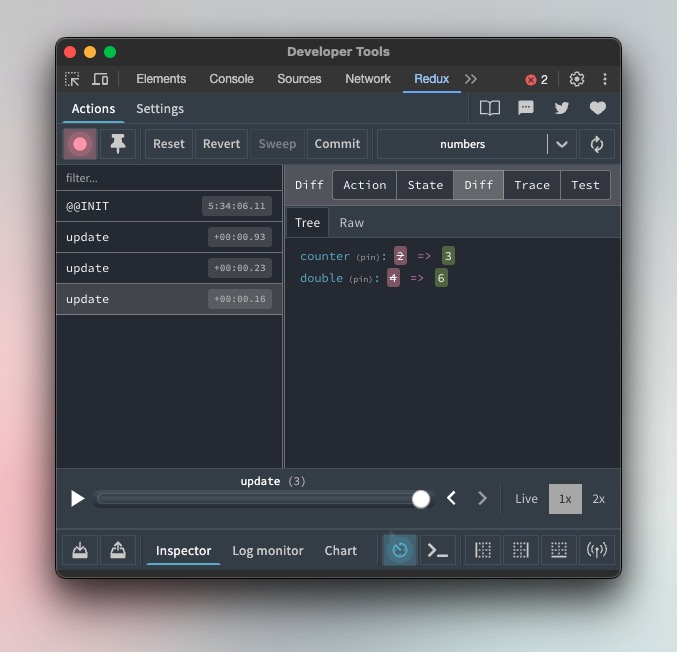

# Svelte Runes Devtools
Easily inspect runes using Redux Devtools



## Installation
```bash
npm install -D svelte-runes-devtools
```

## Usage
```javascript
import { devtools } from "$lib/runes-devtools"

let counter = $state(0)
let double = $derived(counter * 2)
let numbers = $derived({ counter, double })

$inspect(counter, devtools("counter"))
$inspect(double, devtools("double"))
$inspect(numbers, devtools("numbers", { trace: true }))
```

## API
### devtools(name, options)
Connects to the Redux Devtools extension and returns a function that can be used to inspect a rune.

#### name (required)
Type: `string`

The name of the rune. This will be used as the name of the store in the Redux Devtools extension.

#### options (optional)
Type: `object`  

[Reference](https://github.com/reduxjs/redux-devtools/blob/main/extension/docs/API/Arguments.md#name)

